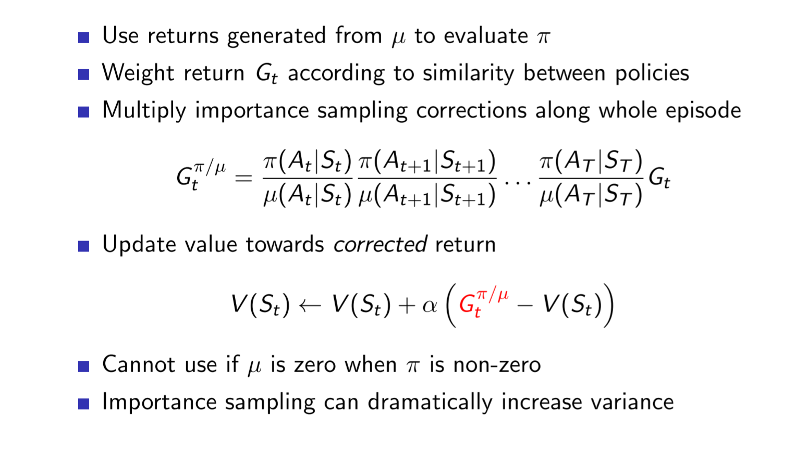

# Reinforcement Learning: An Introduce Notes

## Tabular Solution Method

### Multi-Armed Bandits

#### A k-armed Bandit Problem

k-armed means we can choose k actions when playing with the bandits.
The expected reward or mean of k acitons given the action selected: called value of the action here. 
$$q_*(a) \doteq E[R_t| A_t=a ] $$

##### Action-value Method

Action-value method: 
$$Q(a) \doteq \frac{\sum_{i=1}^{t-1} R_i \cdot  \mathbb{1}_{A_i=a} }{\sum_{i=1}^{t-1} \mathbb{1}_{A_i=a} } $$

Greedy Action Selection:

$$A_t \doteq \underset {a}{argmax} Q_t(a)$$

##### Incremental Implementation 
We now turn  to the how these averages can be computed in a computationally efficient manner, in particular, with constant memory and constant per-time-step computation. 

$$Q_{n+1} = \frac {1}{n} \sum_{i=1}^{n} R_i$$
$$Q_{n+1} =  Q_n + \frac {1}{n} [R_n - Q_n]$$
 
Now we get a simply bandit algorithm: 

#### Tracking Nonstationary Problem

Stationary bandit problems: the reward probabilities do not change over time. But when we are in nonstationary situations, it makes sense to give more weight to recent rewards than to long-past reward. One of most popular ways of doing this is to use a constant step-size parameter. 

$$Q_{n+1} = (1-\alpha) ^ n \cdot   Q_n + \sum_{i=1}^{n} \alpha (1-\alpha)  ^ {n-1} R_i $$

Convergence is not guaranteed for all the choices of the sequence $\{ \alpha_n(a)\}$. If $\alpha$ satisfies the following, the above approximation are assured to converge: 

$\sum_{n=1}^{\infin}\alpha_n(a) = \infin$ and $\sum_{n=1}^{\infin}\alpha_n^2(a)  \lt \infin$ 

#### Optimistic Initial Values
Initial action values can be also be used as a simple way to encourge exploration if we set initial estimate wildly optimistic. Thus this optimmism encourges action-value to explore. 

#### Upper-Confidence-Bound Action Selection
Exploration is needed because there is always uncertainty about the accuracy of the action-value estimates. $\epsilon$-greedy action selection forces the non-greedy action to be tried, but indiscriminately. It would be better to select among the non-greedy actions according to taking into account both both how close their estimates are to being maximal and the uncertainties in those estimates.  One effective way to do this:
$$A_t \doteq \underset {a} {argmax} s] [Q_t(a) + c \sqrt {\frac{lnt} {N_t(a)}} ]$$ 

where $lnt$ denotes the natural logarithm of t (the number that $e = 2.71828$), $N_t(a)$ denotes the number of times that action a has been selected prior to time t 
.  The number $c> 0$ controls
the degree of exploration. If $N_t(a) = 0$, then a is considered to be a maximizing action. 

The idea of UCB action selection is that the square-root term is a measure of the uncertainty or variance in the estimate of a’s value. The quantity being max’ed over is thus a sort of upper bound on the possible true value of action a,with c determining the confidence level. Each time a is selected the uncertainty is presumably reduced: Nt(a) increments, and, as it appears in the denominator, the uncertainty term decreases. On the other hand, each time an action other than a is selected, t increases but Nt(a) does not; because t appears in the numerator, the uncertainty estimate increases. The use of the natural logarithm means that the increases get smaller over time, but are unbounded; all actions will eventually be selected, but actions with lower value estimates, or that have already been selected frequently, will be selected with decreasing frequency over time.

#### Gradient Bandit Algorithms

Here we consider learning a nummerical preference for each action $a$, which we denote $H_t(a)$. The larger the preference, the more often that action is taken. 

A softmax distribution:
$$Pr\{A_t = a\} \doteq \frac{e^{H_t(a)}}{\sum_{b=1}^{k} e^{H_t(b)}} \doteq \pi_t(a)$$
$\pi_t(a)$ for the probability of taking action a at time step t.  
There is 
 

#### Associative Search (Contextual Bandits)

In a general reinforcement learning task there is more than one situation, and the goal is to learn a policy: a mapping from situations to the actions that are best in those situations. Associative search tasks are often now called contextual bandits in the literature. Associative search tasks are intermediate between the k-armed bandit problem and the full reinforcement learning problem. They are like the full reinforcement learning problem in that they involve learning a policy, but like our version of the k-armed bandit problem in that each action a↵ects only the immediate reward. If actions are allowed to affect the next situation as well as the reward, then we have the full reinforcement learning problem. We present this problem in the next chapter and consider its ramifications throughout the rest of the book.

### Finite Markov Desicion Process 

#### The Agent-Environment Interface

* Trajectory 
The MDP and agent together thereby give rise to a sequence or *traject_ory* that begins like this:
$$S_0, A_0, R_1, S_1, A_1, R_2,...$$ 
* Finite MDP
    In a **finite MDP**, the sets of **states, actions, and rewards (S, A, and R) all have a finite number of elements**. In this case, the random variables $R_t$ and $S_t$ have well defined discrete probability distributions dependent only on the preceding state and action.
    Dynamics of MDPs: 
    $$p(s', r|s,a ) \doteq Pr\{S_t = s', R_t = r | S_{t-1}=s, A_{t-1} = a\}$$
    The above probabilities satisfy the constraint:
    $$\sum_{s' \in S} \sum{r \in R} p(s', r|s,a )  = 1) {\text{ for all s $\in$ S, a $\in$ A(s)}}$$

* **Markov Property**
  The probability given by p completely characterizes the environment's dynamics. That is, the probability of each possible values for $S_t$ and $R_t$ depends only on the immediately preceding state and action, $S_{t-1}$ and $A_{t-1}$, and not at all on earlier states and actions. 

  This is best viewed a restriction not on the decision process, but on the state. The state must include information about all aspects of the past agent–environment interaction that make a di↵erence for the future. If it does, then the state is said to have the **Markov property**.

* Expected Reward:  for state-action pairs $r: S \times A \rightarrow  \mathbb{R}$
  $$r(s,a) \doteq E[R_t | S_{t-1} = s, A_{t-1} = a] = \sum_{r \in R} r \sum_{s' \in S} p(s', r|s,a ) $$
  There are also other expected rewards by state-action-next-state triples. 
  

* State-transition probability
  $$p(s'| s, a) \doteq Pr\{S_t = s' | S_{t-1}=s, A_{t-1} = a \} = \sum_{r \in R} p(s', r|s,a ) $$

In particular, **the boundary between agent and environment is typically not the same as the physical boundary of a robot’s or animal’s body**. Usually, the boundary is drawn closer to the agent than that. For example, the motors and mechanical linkages of a robot and its sensing hardware should usually be considered parts of the environment rather than parts of the agent. **The general rule we follow is that anything that cannot be changed arbitrarily by the agent is considered to be outside of it and thus part of its environment.**   
 We do not assume that everything in the environment is unknown to the agent. For example, the agent often knows quite a bit about how its rewards are computed as a function of its actions and the states in which they are taken. But we always consider the reward computation to be external to the agent because it defines the task facing the agent and thus must be beyond its ability to change arbitrarily. In fact, in some cases the agent may know everything about how its environment works and still face a di reinforcement learning task, just as we may know exactly how a puzzle like Rubik’s cube works, but still be unable to solve it.   
 The agent–environment boundary represents the limit of the agent’s absolute control, not of its knowledge. 

#### Goals and Rewards 
In reinforcement learning, **the purpose or goal of the agent is formalized in terms of a special signal, called the reward**, **passing from the environment to the agent**. 

It is critical that the rewards we set up truly indicate what we want accomplished. In particular, **the reward signal is not the place to impart to the agent prior knowledge about how to achieve what we want it to do.** The reward signal is your way of communicating to the robot what you want it to achieve, not how you want it achieved.6

#### Returns and Episodes 
The agent's goal is to maximize the cumulative reward it recieves in the long run.
* Episode task: When there is a natural notion of final time step, that is, when the agent–environment interaction breaks naturally into subsequences, which we call **episodes**. Each episode ends in a special state called terminal state ($T$). 
* Continuous task:  In many cases the agent–environment interaction does not break naturally into identifiable episodes, but goes on continually without limit, (which called continuing tasks).
* Return definition:
  $$G_t \doteq R_{t+1} + \gamma \cdot R_{t+2} + \gamma^2 \cdot R_{t+3} + \ldots = \sum_{k=0} ^ {\infin} \gamma^k R_{t+k+1}$$ where $\gamma$ is a parameter, $0 \le \gamma \le 1$, called **discounting rate**. 
  * If $\gamma \lt 1$, the infinite sum in the above formula has a finite value as long as the reward sequence $\{R_k\} $ is bounded. 
  * If the $\gamma = 0$, the agent is 'myopic' in being concerned only with maximizing immediate rewards. If each of the agent's actions happened to influence only the immediate reward, not future rewards as well. 
  * As $\gamma$ approaches to 1, the return objective takes future rewards into account more strongly, the agent becomes more farsighted. 
  * Returns at successive time step:   
     

### Bellman Equations 
#### State-Value Bellman Equation
By recalling the definition of return, we could get the follow equation for state value:
$$
\begin{align}
v_{\pi} = E_{\pi}[G_t | S_t = s]  \\ 
v_{\pi} = \sum_a \pi(a|s) \sum_{r} \sum_{s'} P(s', r | s, a) \cdot [r + \gamma E_{\pi} [G_{t+1} | S_{t+1}  = s']]  \\
v_{\pi} = \sum_a \pi(a|s) \sum_{r} \sum_{s'} P(s', r | s, a) \cdot [r + \gamma \cdot v_{\pi}(s')] 
\end{align} 
$$ 

$$
E_{\pi}[G_{t+1} |S_{t+1} = s'] = \sum_{a'} \pi(a'| s') \sum_{r'} \sum_{s''} p(r', s''| s', a') \cdot [r' +  \gamma E_{\pi} [G_{t+2} | s_{t+2} = s'']
$$ 

So we change a value evaluation problem into solve linear equations. 

#### Action-Value Bellman Equation
$$
\begin{align}
q(s, a) \doteq E_{\pi}[G_t|s_t = s, A_t = a] \\
q(s, a) = \sum_{r} \sum_{s'} p(r, s' | s, a) \cdot (r + \gamma \cdot E_{\pi}[G_{t+1}|S_{t+1} = s']) \\ 
q(s, a) = \sum_{r} \sum_{s'} p(r, s' | s, a) \cdot (r + \gamma \sum_{a'} \pi(a' | s') q_{\pi}(s', a')) \\ 
q(s, a) = \sum_{r} \sum_{s'}  p(r, s' | s, a) \cdot (r + \gamma \cdot ( \sum_{a'} \pi(a'|s') \sum_{r'} \sum_{s''} p(r', s'' | s', a') \cdot ( r' + \gamma (E_{\pi} [G_{t+2} | S_{t+2} = s'', A_{t+1} = a))
\end{align}
$$

### Bellman Optimality Equation

#### Optimal Value Function 
$$ \pi_1  \ge \pi_2 \text{if and only if  } v_{\pi 1} \ge v_{\pi_2} \text{ for all s $ \in$ S }  $$

So we get the best policy by following:

$$v_{\pi_*} (s)\doteq E_{\pi_*}[G_t | S_t 
= s] = \underset{\pi} {max} v_{\pi}(s) \text{ for all s $\in$ S}$$

$$q_{\pi_*} (s, a)  \doteq \underset {\pi} {max} q_{\pi}(s, a) \text{ for all s $\in$ S and a $\in$ A }$$

#### Optimal State Value Function
Firstly we have the above state value function. Then we apply the optimal operation：
$$ v_*(s) = \sum_{a} \pi_* (a|s) \sum_{r} \sum_{s'} p(r, s'| s, a) (r + \gamma \cdot v_*(s'))$$
So if the we are using the above formula in a deterministic condition:
$$v_*(s) = \underset{a}{max} p(r, s'| s, a) (r + \gamma \cdot v_*(s'))$$ 

#### Optimal Action Value Function
Firstly we have action value Bellman equation, if we apply the best policy:
$$ q_*(s, a) = \sum_r \sum_{s'} p(r, s' | s, a) (r + \sum_a \pi_* (a | s) q_* (s', a'))  $$
And if we consider in a deterministic condition:
$$ q_*(s, a) = \sum_r \sum_{s'} p(s', r | s, a) (r + \gamma \cdot \underset{a}{max} q_*(s', a'))$$

**Notice that optimality equations can not be solved by a linear solver since max operation is not linear!!**

Our framing of the reinforcement learning problem forces us to settle for approximations. However, it also presents us with some unique opportunities for achieving useful approximations. For example, in approximating optimal behavior, **there may be many states that the agent faces with such a low probability that selecting suboptimal actions for them has little impact on the amount of reward the agent receives.** Tesauro’s backgammon player, for example, plays with exceptional skill even though it might make very bad decisions on board configurations that never occur in games against experts. In fact, it is possible that TD-Gammon makes bad decisions for a large fraction of the game’s state set. **The online nature of reinforcement learning makes it possible to approximate optimal policies in ways that put more effort into learning to make good decisions for frequently encountered states, at the expense of less e↵ort for infrequently encountered states.** This is one key property that distinguishes reinforcement learning from other approaches to approximately solving MDPs.

### Dynamic Programming

#### Policy Evaluation
We mainly follow the below formula:   
$$v_{k+1}(s) = \sum_{a} \pi(a|s) \sum_{s', r} p(s', r|s, a) (r + \gamma v_k(s')) $$

#### Policy Improvement
We could find greedy policy by following: 

The greedy policy takes action that looks the best at the short term. (one step ahead according to $v_{\pi}$)

#### Policy Iteration

Once a policy $\pi$ has been improved using $v_{\pi}$ to yield a better policy, $v_{\pi'}$, we can then compute $v_0$ and improve it again to yield an even better. We can thus obtain a sequence of monotonically improving policies and value functions:  
$$ \pi_0 \rightarrow v_0 \rightarrow \pi_1 \rightarrow v_1 \rightarrow \pi_2 \rightarrow \cdots $$

#### Value Iteration 

The policy evaluation step of policy iteration can be truncated in several ways without losing the convergence guarantees of policy iteration. One important special case is **when policy evaluation is stopped after just one sweep (one update of each state)**. This algorithm is called **value iteration**. It can be written as **a particularly simple update operation that combines the policy improvement and truncated policy evaluation steps**:

   
for all state $s \in S$. For arbitrary $v_0$, the sequence $\{v_k\}$ can be shown to converge to $v_*$ under the same conditions that guarantee the existence of $v_*$. 

#### Asynchronous Dynamic Programming

A major drawback to the DP methods that we have discussed so far is that they involve operations over the entire state set of the MDP, that is, they require sweeps of the state set. If the state set is very large, then even a single sweep can be prohibitively expensive.    
**Asynchronous DP algorithms are in-place iterative DP algorithms that are not organized in terms of systematic sweeps of the state set**. These algorithms update the values of states in any order whatsoever, using whatever values of other states happen to be available.   
The values of some states may be updated several times before the values of others are updated once. To converge correctly, however, an asynchronous algorithm must continue to update the values of all the states: it can’t ignore any state after some point in the computation. Asynchronous DP algorithms allow great flexibility in selecting states to update.     
At the same time, the latest value and policy information from the DP algorithm can guide the agent’s decision making. For example, we can apply updates to states as the agent visits them. This makes it possible to focus the DP algorithm’s updates onto parts of the state set that are most relevant to the agent. This kind of focusing is a repeated theme in reinforcement
learning. 

#### Generalized Policy Iteration

Using the term *generalized policy iteration* **(GPI)** to refer to the general idea of letting policy-evaluation and policy improvement processes interact, independent of the granularity and other details of the two processes. Almost all reinforcement learning methods are well described as GPI. That is, all have been improved with respect to the value function and the value function and the value function always being driven toward the value function for the policy.   
It is easy to see that if both the evaluation process and improvement process stablized, then the value function and policy must be optimal.  
\center  

#### Efficiency of Dynamic Programming

DP may not be practical for very large problems, but compared with other methods for solving MDPs.   
DP method is guaranteed to find an optimal policy in polynomial time even though the total number of (deterministic) policies is $k^n$.  
Linear programming methods become impractical at a much smaller number of states than do DP methods (by a factor of about 100). For the largest problems, only DP methods are feasible.

DP is sometimes thought to be of limited applicability because of the **curse of dimensionality**, the fact that the number of states often grows exponentially with the number of state variables. Large state sets do create difficulties but these are inherent difficulties of the problem, not of DP as a solution method.  
In practice, DP methods can be used with today’s computers to solve MDPs with millions of states. And on problems with large state spaces, **asynchronous DP** solutions are often preferred. 

### Monte-Carlo Methods 
Here we do not assume complete knowledge of the environment. Monte Carlo methods require only experience—sample sequences of states, actions, and rewards from actual or simulated interaction with an environment. Learning from actual experience is striking because it requires no prior knowledge of the environment’s dynamics, yet can still attain optimal behavior.    
Learning from simulated experience is also powerful. **Although a model is required, the model need only generate sample transitions, not the complete probability distributions of all possible transitions that is required for dynamic programming (DP).** **In surprisingly many cases it is easy to generate experience sampled according to the desired probability distributions, but infeasible to obtain the distributions in explicit form.** 

####  Monte Carlo Evaluation 
* Goal: learn $V_{\pi} $ from the episodes of experience under policy $\pi$ 
$$S_0, A_0, R_1; S_1, A_1, R_2; \cdots, S_T \thicksim
 \pi$$
* Recall that:  
$$R_t = r_{t+1} + \gamma r_{t+2} + \dots + \gamma^T \cdot r_T$$
* MC uses the simplest possible idea: value = mean return. Instead of computing expectations, sample the long term return under the policy:

##### Monte Carlo First Visit Vs. Every Visit

In particular, suppose we wish to estimate $v_{\pi}$, each occurrence of state s in an episode is called a visit to $s$. Of course, s may be visited multiple times in the same episode; let us call the first time it is visited in an episode the first visit to s.The **first-visit MC method estimates as the average of the returns following first visits to s, whereas the every-visit MC method averages the returns following all visits to s**.   
 These two Monte Carlo (MC) methods are very similar but have slightly different theoretical properties. First-visit MC has been most widely studied, dating back to the 1940s, and is the one we focus on in this chapter. **Every-visit MC extends more naturally to function approximation and eligibility traces**, as discussed in Chapters 9 and 12. First-visit MC is shown in procedural form in the box.

 

#### Monte Carlo Estimation of Action Value

With a model, state values alone are used to determine a policy; one simply looks ahead one step and chooses whichever action leads to the best combination of reward and next state. **Without a model, however, state values alone are not useful.    
One must explicitly estimate the value of each action in order for the values to be useful in suggesting a policy. Thus, one of our primary goals for Monte Carlo methods is to estimate $q_{\pi}$. 

The only complication is that many state–action pairs may never be visited. With no returns to average, the Monte Carlo estimates of the other actions will not improve with experience. To compare alternatives we need to estimate the value of all the actions from each state, not just the one we currently favor. This is the general problem of **maintaining exploration**, we must **assure continual exploration**. One way to do this is by specifying that the episodes start in a state–action pair, and that every pair has a nonzero probability of being selected as the start. This guarantees that all state–action pairs will be visited an infinite number of times in the limit of an infinite number of episodes. We call this the assumption of **exploring starts**.   
The assumption of exploring starts is sometimes useful, but of course it **cannot be relied upon in general, particularly when learning directly from actual interaction with an environment**. The most
common alternative approach to assuring that all state–action pairs are encountered is to consider **only policies that are stochastic with a nonzero probability of selecting all actions in each state**. 
For now, we retain the assumption of exploring starts and complete the presentation of a full Monte Carlo control method. 
#### Monte Carlo Control 

Monte Carlo control is a model-free method if we make decision based on Action-Value.  

* Greedy policy improvement over $V(s)$ requires model of MDP $\pi(s) = \underset{a \in A}{argmax} R_a^s +P_{s,s'}^a V(s')$ 
* But Greedy policy improvement over Q(s, a) is model-free

##### Monte Carlo Control with Exploring Start 
Firstly we consider Monte Carlo method as a classical policy iteration problem:
$$\pi_0 \stackrel{E}{\rightarrow} q_{\pi_0} \stackrel{I}{\rightarrow}  \pi_1 \stackrel{E}{\rightarrow} q_{\pi_1} \stackrel{I}{\rightarrow} \cdots \stackrel{I}{\rightarrow} \pi_* \stackrel{E}{\rightarrow} v_* $$

* Evaluation: it is done exactly as described in the preceding section, we use the MC with exploring starts here. 
* Iteration: for any action-value function q, the corresponding greedy policy is the one that, for each $s \in S$, deterministiclly chooses an action with maximal action value:
  $$\pi(s) \doteq \underset {a}{argmax} q(s, a)$$

There are some approaches to avoid infinite number of episode nominally required for policy iteration, in which we give up policy evaluation before we move to policy iteration, as we have introduced in GPI.  
One extreme of this idea is value iteration, in which only one iteration of iterative policy evaluation is performed between each stop of iteration. **The inplace version of value evaluation** is even more extreme, there we alternate between improvement and evaluation steps for single states.   
For MC it is natural to **alternate between evaluation and improvement on an episode-by-episode basis**. After each episode, the observed returns are used for policy evaluation, and then the policy is improved at all the states visited in the episode. A complete simple algorithm along these lines, which we call Monte Carlo ES, for Monte Carlo with Exploring Starts. 

##### Monte Carlo Control without Exploring Start 

**How can we avoid the unlikely assumption of exploring starts?**
The only general way to ensure that all actions are selected infinitely often is for the agent to continue to select them. There are two approaches to ensuring this, resulting in what we call **on-policy methods and off-policy methods**. 

The Monte-Carlo method with Exploring Start is an on-policy method. The overall idea of **on-policy Monte Carlo control is still that of GPI**. As in Monte Carlo ES, we use first-visit MC methods to estimate the action-value function for the current policy. **Without the assumption of exploring starts, however, we cannot simply improve the policy by making it greedy with respect to the current value function**, because that would prevent further exploration of nongreedy actions. Fortunately, **GPI does not require that the policy be taken all the way to a greedy policy, only that it be moved toward a greedy policy**. In our on-policy method we will move it only to an "greedy policy". For any "-soft policy", $\pi$, any "greedy policy with respect to $q_{\pi}$ is guaranteed to be better than or equal to $\pi$. The complete algorithm is given in the box below.  

Now we only achieve the best policy among the **"soft policies"**, but on the other hand, we have eliminated the assumption of exploring starts. 

##### On-policy Vs. Off-policy 

On-policy 

* **On-policy**  -- **Target policy = Behavior Policy**
  * learning “Learn on the job” Learn about policy $\pi$ from experience sampled from $\pi$
  * It attempts to evaluate or improve the policy that is used to make decisions 

* **Off-policy** -- **Target policy is not the same as Behavior Policy**
  * Off-policy learning “Look over someone’s shoulder”
Learn about policy π from experience sampled from $\mu$
  * It evaluates or improves the policy different from that used to generate data. 

#### Exploration Vs. Exploitation

Ideally, exploration should not be constant during training. It should be larger at the beginning and lower after a lot of experience is accumulated (more greedy when make better estimations) but never disappear(Environment may change).     
This requirement is asked in convergence proofs of most RL algorithms, f.i. in MC. In $\epsilon$-greedy, this is implemented with variable $\epsilon$ starting from 1 and decreasing with number of experiences until a minimum value from which does not decrease further, f.i:
$$\epsilon = max(\frac{1}{\alpha T}, 0.1)$$  
where **T is the number of Trials done** and **$\alpha$ is a constant that controls decrease of exploration**.   

Another popular way to explore is using **Softmax exploration or Gibb's exploration or Boltzman exploration**. Idea is that probability depends on the value of actions, with bias of exploration towards more    promising actions. Softmax action selection methods grade action probabilities by estimated values 
$$P(s, a) = \frac{e^{\frac{Q(s,a)}{\tau}}}{\sum_{a'\in A}e^{\frac{Q(s,a)}{\tau}}}$$ 

where **parameter $\tau$ is called temperature and decreases with experience When $\tau$ is very large, all actions with roughly same probability of being selected. When $\tau$ is low, almost certainty of selecting the action with higher Q-value**.

##### $\epsilon$ Greedy Exploration

When applying greedy policy on a given state, we actually keep randomly selecting a action with probability of $\epsilon$:
$$\pi = \begin{cases} \frac{\epsilon}{m}+ 1- \epsilon, & \text {if $a^*=\underset {a}{argmax} Q(s, a)$ } \\ \frac{\epsilon}{m} & \text {otherwise} \end{cases}$$

**$\epsilon$-Greedy Policy Improvement**

#### Off-policy Prediction via Importance Sampling
Off-policy: **Target policy is not the same as Behavior Policy**. Off-policy method is often of greater variance and slower convergence.

How can they learn about the optimal policy while behaving according to an exploratory policy? The on-policy approach in the preceding section is **actually a compromise**—it learns action values not for the optimal policy, but for **a near-optimal policy** that still explores.  
A more **straightforward approach is to use two policies, one that is learned about and that becomes the optimal policy, and one that is more exploratory and is used to generate behavior**. The policy being learned about is called the **target policy**, and the policy used to generate behavior is called the **behavior policy**. In this case we say that learning is from data “off” the target policy, and
the overall process is termed off-policy learning.

We apply **importance sampling** to off-policy learning by weighting returns according to the relative probability of their trajectories occurring under the target and behavior policies, called the ***importance-sampling ratio***. Given a starting state, the probability of the subsequent state–action trajectory, $A_t$,$S_{t+1}$,$A_{t+1}$,. .., $S_T$, occurring under any policy $\pi$ is
$$
\begin{align}
Pr\{A_t, S_{t+1}, A_{t+1}, \cdots, S_T \} = \\
\pi(A_t|S_t)p(S_{t+1} | S_t, A_t) \pi(A_{t+1}|S_{t+1})p(S_{t+2} | S_{t+1}, A_{t+1}) \cdots p(S_T | S_{T-1}, A_{T-1}) \\
= \prod_{k=t}^{T-1} \pi(A_k|S_k)p(S_{k+1} | S_k, A_k)
\end{align}
$$

where $p$ here is the state-transition probability function defined by (3.4). Thus, the relative probability of the trajectory under the target and behavior policies (the importance-
sampling ratio) is

$$\rho \doteq \frac{\prod_{k=t}^{T-1} \pi(A_k|S_k)p(S_{k+1} | S_k, A_k)}{\prod_{k=t}^{T-1} b(A_k|S_k)p(S_{k+1} | S_k, A_k)} = \prod_{k=t}^{T-1} \frac{\pi(A_k|S_k) }{ b(A_k|S_k)} $$ 

##### Importance Sampling for Off-Policy Monte-Carlo

##### Importance Sampling for Off-Policy TD

<!-- #### Incremental Implementation -->

#### Off-policy Monte Carlo Control 

A potential problem is tha this method **learns only from the tails of episodes**, when all of the **remaining actions in the episode are greedy**. If **nongreedy actions are common, then learning will be slow, particularly for states appearing in the early portions of long episodes**. Potentially, this could greatly slow learning. There has been insu experience with o↵-policy Monte Carlo methods to assess how serious this problem is. If it is serious, the most important way to address it is probably by incorporating temporal-
di↵erence learning, the algorithmic idea developed in the next chapter.

### Temporal-Differenece Learning 
TD learning is a **combination of Monte Carlo ideas and dynamic programming (DP) ideas. Like Monte Carlo methods, TD methods can learn directly from raw experience without a model of the environment’s dynamics**. Like DP, TD methods update estimates based in part on other learned estimates, without waiting for a final outcome (they bootstrap).  
#### TD Prediction
Simplest TD update:  
$$V(S_t) \leftarrow V(S_t) + \alpha [R_{t+1} + \gamma V(S_{t+1} - V(S_t))] $$
This TD method is called $TD(0)$, or one step TD, because it is a special case of $TD(\lambda)$ or n-step TD in later chapter. 
Because $TD(0)$ bases its update in part on an existing estimate, we say it is a boostrapping method like DP. 

We refer to TD and Monte Carlo updates as sample updates because they involve looking ahead to a sample successor state (or state–action pair), using the **value of the successor and the reward along the way to compute a backed-up value, and then updating the value of the original state (or state– action pair) accordingly. Sample updates differ from the expected updates of DP methods in that they are based on a single sample successor rather than on a complete distribution of all possible successors.**

##### TD Error 
$$ \delta_t \doteq R_{t+1} + V_{t+1} - V(S_t) $$

Notice that the TD error at each time is the error in the estimate made at that time. Because the TD error depends on the next state and next reward, it is not actually available until one time step later. That is,  is the error in V(St), available at time t + 1. Also note that if the array V does not change during the episode (as it does not in
Monte Carlo methods), then the **Monte Carlo** error can be written as a sum of TD errors:

#### Advantages of TD Prediction Methods
TD methods update their estimates based in part on other estimates. They **learn a guess from a guess—they bootstrap**. 
Obviously TD has an advantage over DP methods in that it does not require a model  of the environment. 
The next most obvious advantage of TD methods over Monte-Carlo methods that they are naturally implemented online, fully incremental fashion. 
* **But are TD methods sound?**  
TD(0) has been proved to converge to $v_\pi$, in the mean for a constant step-size parameter if it is sufficiently small, and with probability 1 if the step-size parameter decreases according to the usual stochastic approximation conditions $\sum_{n=1}^{\infty} \alpha_n(a) = \infty $ and $\sum_{n=1}^{\infty} \alpha_n^2(a) \lt \infty$ . Most convergence proofs apply only to the table-based case of the algorithm presented above, but some also apply to the case of general linear function approximation. These results are discussed in a more general setting in Chapter 9. 
If both TD and Monte Carlo methods converge asymptotically to the correct predictions, **which method learns faster?**    
Which makes the more e use of limited data? At the current time this is an open question in the sense that no one has been able to prove mathematically that one method converges faster than the other. In fact, it is not even clear what is the most appropriate formal way to phrase this question! **In practice, however, TD methods have usually been found to converge faster than constant-$\alpha$ MC methods on stochastic tasks, as illustrated in below:

#### Sarsa: On-policy TD Control

The first step is to learn an action-value function rather than a state-value function. In particular, for an on-policy method we must estimate $q_{\pi}(s, a)$ for the current behavior policy $\pi$ and for all states s and actions a. This can be done using essentially the same TD method described above for learning $v_{\pi}$.   

$$Q(S_t, A_t) \leftarrow Q(S_t, A_t) + \alpha [R_{t+1} + \gamma \cdot Q(S_{t+1}, A_{t+1}) - Q_{S_t, A_T}]$$

This update is done after every transition from a nonterminal state $S_t$.If $St$+1 is terminal, then $Q(S_{t+1},A_{t+1})$ is defined as zero. This rule uses every element of the quintuple of events, **$(S_t,A_t,R_{t+1},S_{t+1},A_{t+1}), that make up a transition from one state-action pair to the next. This quinAtuple gives rise to the name Sarsa** for the algorithm.   

#### Q_learning: Off-policy TD Control 

One of the early breakthroughs in reinforcement learning was the development of an off-policy TD control algorithm known as Q-learning (Watkins, 1989), defined by

$$Q(S_t, A_t) \leftarrow Q(S_t, A_t) + \alpha[R_{t+1}  + \underset{a}{max}Q(S_{t+1}, a) -  Q(S_t, A_t)]$$

In this case, the learned action-value function, Q, **directly approximates $q_*$,** the optimal action-value function, independent of the policy being followed. However, all that is required for **correct convergence is that all pairs continue to be updated**. As we observed in Chapter 5, this is a minimal requirement in the sense that **any method guaranteed to find optimal behavior in the general case must require it**. Under this assumption and a variant of the usual stochastic approximation conditions on the sequence of step-size parameters, Q has been shown to converge with probability 1 to
$q_*$.   

#### Q_learning VS. Sarsa

#### Expected Sarsa

#### Maximization Bias and Double Q_learnin

### n-Steps Boostrapping

#### n-Step TD Prediction 

#### n-Step Sarsa

#### n-Step Off-policy Learning

#### Off-policy Learning Without Importance Sampling: The n-step Tree Backup Algorithm

## Planning and Learning with Tabular Methods 

## Approximate Solution Methods 

### On-policy Prediction with Approximation

### On-policy Control with Approximation 

### Off-policy Control with Approximation 

### Eligibility Trace 

### Policy Gradient Method

## Looking deeper

* $$f(x_1,x_2,\ldots ,x_n) = x_1^2 + x_2^2 + \cdots + x_n^2$$ 

